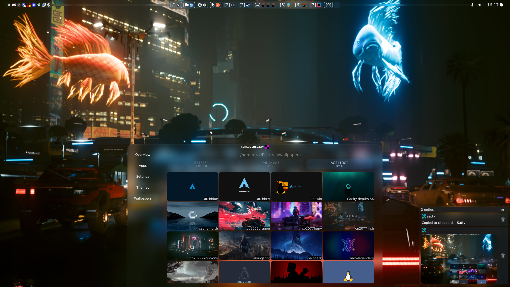
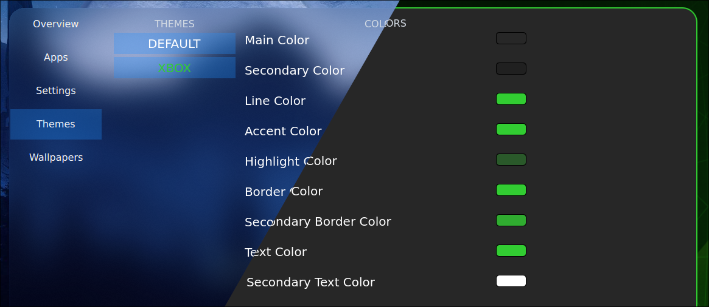
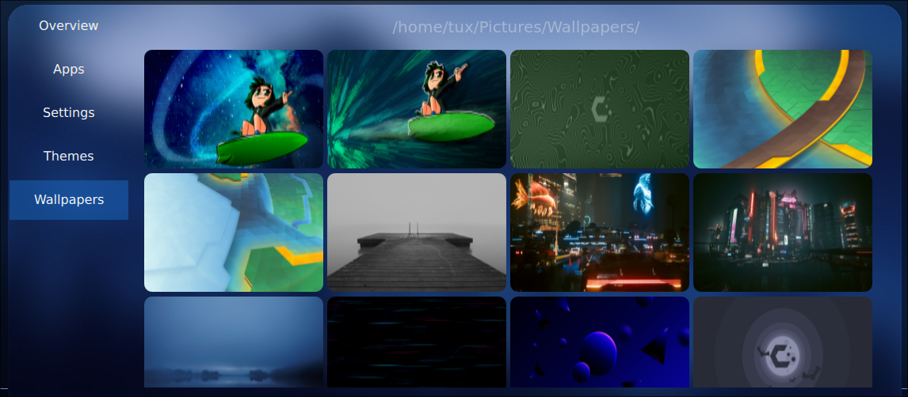
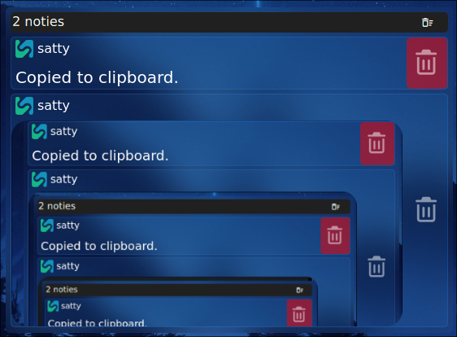

# First Quickshell config

> [!IMPORTANT]
> Only supports Hyprland at the moment

## 🚀 FEATURES:
- Per-monitor wallpapers
- Lockscreen with fprint support
- Hyprland
    - Hypr splash
    - Workspace switching
    - Global shortcuts
- Autohide bar (per-monitor)

### 🎨 Themable

### Wallpaper picker

### 🔔 Notifications with image support

#### 📓 TODO
- [ ] Animations
- [ ] Clipboard manager
- [ ] Save-able themes
- [ ] More WM support (Sway, Niri, etc.)
- [ ] Rework notifications
- [ ] Un-pasta the code
